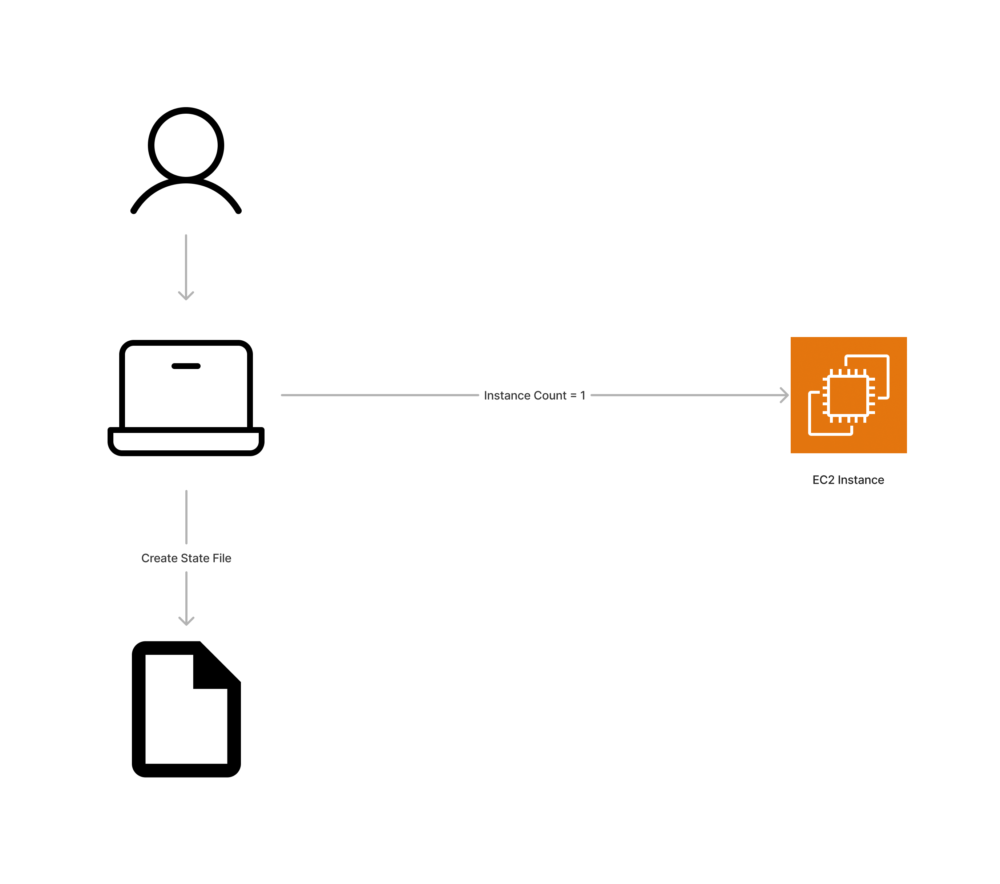
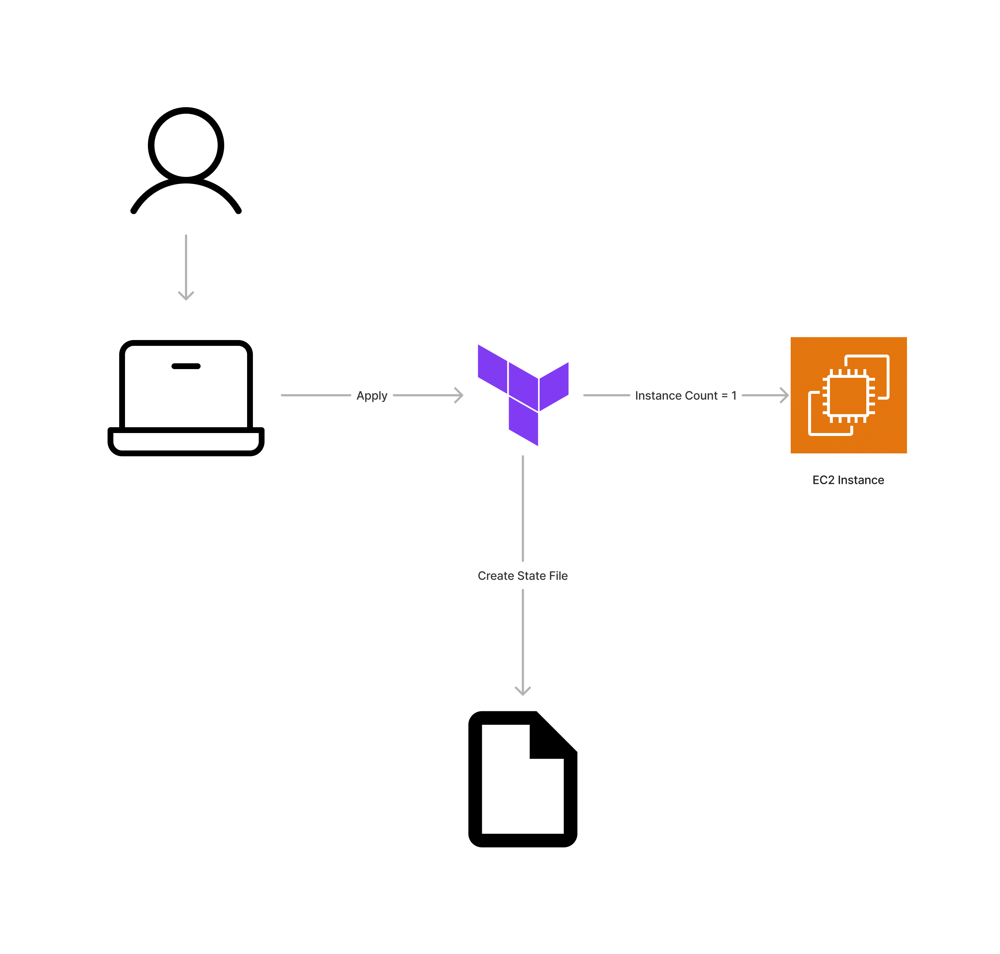
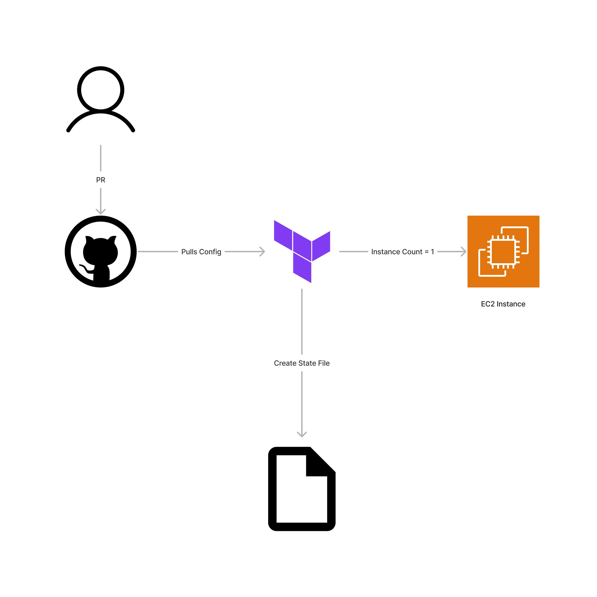

# TFC Demo

This repository serves as a demonstration of using Terraform in various scenarios: locally, with Terraform Cloud (TFC) via the CLI, and in a version-controlled setup.

## Local Deployment

In the local scenario, a user runs Terraform on their laptop to deploy an EC2 instance with required subnets. The state file is stored locally once the instances are created.



### Apply Locally

```bash
cd local
terraform init
terraform apply
```

### Delete Locally

```bash
terraform destroy
```

## Terraform Cloud (TFC) with CLI

Next, we explore the use of Terraform Cloud (TFC) via the CLI. In this scenario, Terraform configurations are executed remotely in TFC, and the state file is managed entirely by TFC.



### Prerequisites for TFC CLI

1. [Create a credentials variable set](https://developer.hashicorp.com/terraform/tutorials/cloud-get-started/cloud-create-variable-set).
2. Update the organization in `main.tf`.

### Apply with TFC CLI

```bash
cd cloud-cli
terraform login
terraform init
terraform apply
```

## Version Control System (VCS)

In the version-controlled setup, Terraform configurations are integrated with a version control system (VCS). Changes trigger automated runs in Terraform Cloud, providing a collaborative and auditable workflow. 



For detailed information on VCS integration, please refer to the documentation of your chosen VCS provider.

Feel free to explore each scenario based on your use case and infrastructure requirements.

# Dynamic Credentials with the Vault Provider

You can use Terraform Cloud’s native OpenID Connect integration with Vault to get dynamic credentials for the Vault provider in your Terraform Cloud runs. This guide is taken from [here](https://developer.hashicorp.com/terraform/cloud-docs/workspaces/dynamic-provider-credentials/vault-backed/aws-configuration)

## Configure Vault
You must enable and configure the JWT backend in Vault. These instructions use the Vault CLI commands, but you can also use Terraform to configure Vault. Refer to our [example Terraform configuration](https://github.com/hashicorp/terraform-dynamic-credentials-setup-examples/tree/main/vault).
### Enable the JWT Auth Backend
Run the following command to enable the JWT auth backend in Vault:
```shell
vault auth enable jwt
```
### Configure Trust with Terraform Cloud
You must configure Vault to trust Terraform Cloud’s identity tokens and verify them using Terraform Cloud’s public key. The following command configures the `jwt` auth backend in Vault to trust Terraform Cloud as an OIDC identity provider:
```shell
vault write auth/jwt/config \
    oidc_discovery_url="https://app.terraform.io" \
    bound_issuer="https://app.terraform.io"
```
The `oidc_discovery_url` and `bound_issuer` should both be the root address of Terraform Cloud, including the scheme and without a trailing slash.

### Create a Vault Policy

You must create a Vault policy that controls what paths and secrets your Terraform Cloud workspace can access in Vault.
Create a file called tfc-policy.hcl with the following content:
```hcl
# Allow tokens to query themselves
path "auth/token/lookup-self" {
  capabilities = ["read"]
}

# Allow tokens to renew themselves
path "auth/token/renew-self" {
    capabilities = ["update"]
}

# Allow tokens to revoke themselves
path "auth/token/revoke-self" {
    capabilities = ["update"]
}

# Configure the actual secrets the token should have access to
path "secret/*" {
  capabilities = ["read"]
}
```

Then create the policy in Vault:

```shell
vault policy write tfc-policy tfc-policy.hcl
```

### Create a JWT Auth Role
Create a Vault role that Terraform Cloud can use when authenticating to Vault.

Vault offers a lot of flexibility in determining how to map roles and permissions in Vault to workspaces in Terraform Cloud. You can have one role for each workspace, one role for a group of workspaces, or one role for all workspaces in an organization. You can also configure different roles for the plan and apply phases of a run.

The following example creates a role called `tfc-role`. The role is mapped to a single workspace and Terraform Cloud can use it for both plan and apply runs.

Create a file called `vault-jwt-auth-role.json` with the following content:
```json
{
  "policies": ["tfc-policy"],
  "bound_audiences": ["vault.workload.identity"],
  "bound_claims_type": "glob",
  "bound_claims": {
    "sub":
"organization:my-org-name:project:my-project-name:workspace:my-workspace-name:run_phase:*"
  },
  "user_claim": "terraform_full_workspace",
  "role_type": "jwt",
  "token_ttl": "20m"
}
```

Then run the following command to create a role named `tfc-role` with this configuration in Vault:
```shell
vault write auth/jwt/role/tfc-role @vault-jwt-auth-role.json
```
To understand all the available options for matching bound claims, refer to the [Terraform workload identity claim specification](/terraform/cloud-docs/workspaces/dynamic-provider-credentials) and the [Vault documentation on configuring bound claims](/vault/docs/auth/jwt#bound-claims). To understand all the options available when configuring Vault JWT auth roles, refer to the [Vault API documentation](/vault/api-docs/auth/jwt#create-role).

!> **Warning:** you should always check, at minimum, the audience and the name of the organization in order to prevent unauthorized access from other Terraform Cloud organizations!

#### Token TTLs
We recommend setting token_ttl to a relatively short value. Terraform Cloud can renew the token periodically until the plan or apply is complete, then revoke it to prevent it from being used further.

## Configure Terraform Cloud
You’ll need to set some environment variables in your Terraform Cloud workspace in order to configure Terraform Cloud to authenticate with Vault using dynamic credentials. You can set these as workspace variables, or if you’d like to share one Vault role across multiple workspaces, you can use a variable set.

### Required Environment Variables
| Variable                  | Value                                                                            | Notes                                                                                                                                                                                                                                                                                         |
|---------------------------|----------------------------------------------------------------------------------|-----------------------------------------------------------------------------------------------------------------------------------------------------------------------------------------------------------------------------------------------------------------------------------------------|
| `TFC_VAULT_PROVIDER_AUTH` | `true`                                                                           | Requires **v1.7.0** or later if self-managing agents. Must be present and set to `true`, or Terraform Cloud will not attempt to authenticate to Vault.                                                                                                                                        |
| `TFC_VAULT_ADDR`          | The address of the Vault instance to authenticate against.                       | Requires **v1.7.0** or later if self-managing agents. Will also be used to set `VAULT_ADDR` in the run environment.                                                                                                                                                                           |
| `TFC_VAULT_RUN_ROLE`      | The name of the Vault role to authenticate against (`tfc-role`, in our example). | Requires **v1.7.0** or later if self-managing agents. Optional if `TFC_VAULT_PLAN_ROLE` and `TFC_VAULT_APPLY_ROLE` are both provided. These variables are described [below](/terraform/cloud-docs/workspaces/dynamic-provider-credentials/vault-configuration#optional-environment-variables) |

### Optional Environment Variables
You may need to set these variables, depending on your Vault configuration and use case.

| Variable                               | Value                                                                                          | Notes                                                                                                                                                                                                          |
|----------------------------------------|------------------------------------------------------------------------------------------------|----------------------------------------------------------------------------------------------------------------------------------------------------------------------------------------------------------------|
| `TFC_VAULT_NAMESPACE`                  | The namespace to use when authenticating to Vault.                                             | Requires **v1.7.0** or later if self-managing agents. Will also be used to set `VAULT_NAMESPACE` in the run environment.                                                                                       |
| `TFC_VAULT_AUTH_PATH`                  | The path where the JWT auth backend is mounted in Vault. Defaults to jwt.                      | Requires **v1.7.0** or later if self-managing agents.                                                                                                                                                          |
| `TFC_VAULT_WORKLOAD_IDENTITY_AUDIENCE` | Will be used as the `aud` claim for the identity token. Defaults to `vault.workload.identity`. | Requires **v1.7.0** or later if self-managing agents. Must match the `bound_audiences` configured for the role in Vault.                                                                                       |
| `TFC_VAULT_PLAN_ROLE`                  | The Vault role to use for the plan phase of a run.                                             | Requires **v1.7.0** or later if self-managing agents. Will fall back to the value of `TFC_VAULT_RUN_ROLE` if not provided.                                                                                     |
| `TFC_VAULT_APPLY_ROLE`                 | The Vault role to use for the apply phase of a run.                                            | Requires **v1.7.0** or later if self-managing agents. Will fall back to the value of `TFC_VAULT_RUN_ROLE` if not provided.                                                                                     |
| `TFC_VAULT_ENCODED_CACERT`             | A PEM-encoded CA certificate that has been Base64 encoded.                                     | Requires **v1.9.0** or later if self-managing agents. This certificate will be used when connecting to Vault. May be required when connecting to Vault instances that use a custom or self-signed certificate. |

## Vault Provider Configuration
Once you set up dynamic credentials for a workspace, Terraform Cloud automatically authenticates to Vault for each run. Do not pass the `address`, `token`, or `namespace` arguments into the provider configuration block. Terraform Cloud sets these values as environment variables in the run environment.

You can use the Vault provider to read static secrets from Vault and use them with other Terraform resources. You can also access the other resources and data sources available in the [Vault provider documentation](https://registry.terraform.io/providers/hashicorp/vault/latest). You must adjust your [Vault policy](#create-a-vault-policy) to give your Terraform Cloud workspace access to all required Vault paths.

~> **Important:** data sources that use secrets engines to generate dynamic secrets must not be used with Vault dynamic credentials. You can use Vault's dynamic secrets engines for AWS, GCP, and Azure by adding additional configurations. For more details, see [Vault-backed dynamic credentials](/terraform/cloud-docs/workspaces/dynamic-provider-credentials/vault-backed).

### Specifying Multiple Configurations

~> **Important:** If you are self-hosting [Terraform Cloud Agents](/terraform/cloud-docs/agents), ensure your agents use [v1.12.0](/terraform/cloud-docs/agents/changelog#1-12-0-07-26-2023) or above. To use the latest dynamic credentials features, [upgrade your agents to the latest version](/terraform/cloud-docs/agents/changelog).

~> **Important:** Ensure you are using version **3.18.0** or later of the **Vault provider** as the required [`auth_login_token_file`](https://registry.terraform.io/providers/hashicorp/vault/latest/docs#token-file) block was introduced in this provider version.

You can add additional configurations to handle multiple distinct Vault setups, enabling you to use multiple [provider aliases](/terraform/language/providers/configuration#alias-multiple-provider-configurations) within the same workspace.

For more details, see [Specifying Multiple Configurations](/terraform/cloud-docs/workspaces/dynamic-provider-credentials/specifying-multiple-configurations).

#### Required Terraform Variable

To use additional configurations, add the following code to your Terraform configuration. This lets Terraform Cloud supply variable values that you can then use to map authentication and configuration details to the correct provider blocks.

```hcl
variable "tfc_vault_dynamic_credentials" {
  description = "Object containing Vault dynamic credentials configuration"
  type = object({
    default = object({
      token_filename = string
      address = string
      namespace = string
      ca_cert_file = string
    })
    aliases = map(object({
      token_filename = string
      address = string
      namespace = string
      ca_cert_file = string
    }))
  })
}
```

#### Example Usage

```hcl
provider "vault" {
  // skip_child_token must be explicitly set to true as TFC manages the token lifecycle
  skip_child_token = true
  address          = var.tfc_vault_dynamic_credentials.default.address
  namespace        = var.tfc_vault_dynamic_credentials.default.namespace

  auth_login_token_file {
    filename = var.tfc_vault_dynamic_credentials.default.token_filename
  }
}

provider "vault" {
  // skip_child_token must be explicitly set to true as TFC manages the token lifecycle
  skip_child_token = true
  alias            = "ALIAS1"
  address          = var.tfc_vault_dynamic_credentials.aliases["ALIAS1"].address
  namespace        = var.tfc_vault_dynamic_credentials.aliases["ALIAS1"].namespace

  auth_login_token_file {
    filename = var.tfc_vault_dynamic_credentials.aliases["ALIAS1"].token_filename
  }
}
```


